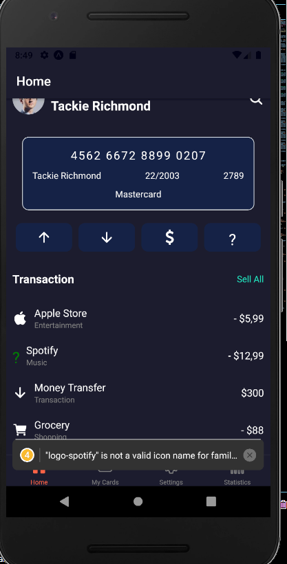

# My React Native App

Welcome to My React Native App! This app allows users to manage their cards, view statistics, and customize settings.

## Table of Contents

- [Description](#description)
- [Installation](#installation)
- [Usage](#usage)
- [Features](#features)
- [Screenshots](#screenshots)


## Description

My React Native App is designed to provide users with a seamless experience to manage their cards, view detailed statistics, and customize their app settings. The app features a clean and intuitive UI with both dark and light themes.

## Installation

Follow these steps to install the app:

1. Clone the repository:

    ```sh
    git clone https://github.com/niiofficial/rn-assignment5-11078425.git
    ```

2. Navigate to the project directory:

    ```sh
    cd UIcardcoine
    ```

3. Install the dependencies:

    ```sh
    npm install
    ```

4. Start the app:

    ```sh
    npm start
    ```

## Usage

1. Launch the app on an emulator or a real device.
2. Navigate through the Home, My Cards, Statistics, and Settings tabs using the bottom navigation bar.

## Features

- **Home Screen**: View welcome message, card details, and recent transactions.
- **My Cards**: Manage and view all your cards.
- **Statistics**: View detailed statistics and insights.
- **Settings**: Customize app settings including theme switching.

## Screenshots

### settings screen light


### settings screen dark


### homescreen dark



### Homescreen Light


